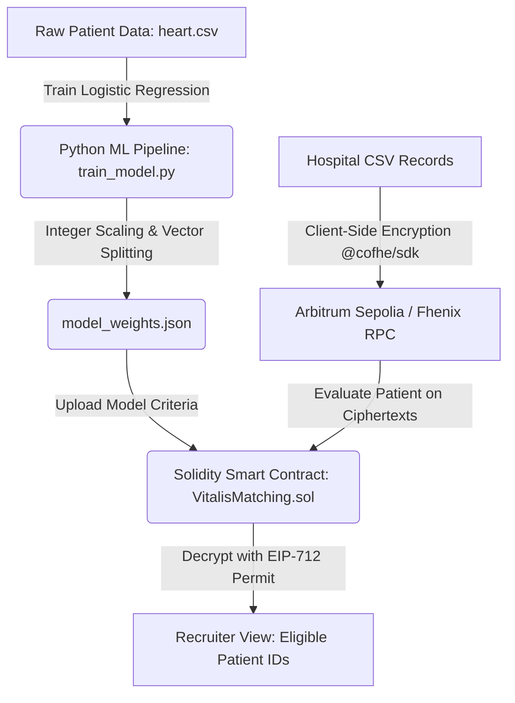

# Vitalis AI 🔬🛡️
**Confidential Clinical Trial Matching Engine Powered by Fully Homomorphic Encryption (FHE)**

Vitalis AI is a secure, privacy-preserving patient matching engine that qualifies patients for clinical trials without exposing their protected health information (PHI). By combining **Fully Homomorphic Encryption (FHE)** on the **Fhenix** blockchain with **Machine Learning (Logistic Regression)**, Vitalis AI enables hospitals to run eligibility assessments directly on encrypted patient datasets.

Pharma recruiters can securely verify eligibility (yes/no match) via cryptographic permits, while raw patient attributes (age, heart rate, blood pressure, etc.) remain permanently encrypted and undecipherable to all external entities.

---

## 🌟 Key Features

*   **Real-time FHE Encryption**: Streaming CSV uploader that encrypts clinical records client-side using `@cofhe/sdk` before blockchain submission.
*   **On-Chain ML Inference**: Executing machine learning decision-boundaries on encrypted inputs (`euint32` values) using Fhenix FHE operations.
*   **Underflow-Safe Scoring**: Custom Solidity math logic that processes negative weights and intercepts safely on-chain.
*   **Permit-Based Decryption**: Pharma recruiters can verify eligibility outcomes through standard EIP-712 permit signatures, leaving clinical details sealed.
*   **Interactive Confidential Dashboard**: Modern React frontend utilizing Bento Grid layouts, custom dashboards, real-time telemetry, and visual matching engine queues.

---

## 🏗️ Architecture Overview

The system operates across three distinct, integrated layers:



### 1. The ML Engine (`/ml`)
*   **Dataset**: UCI Heart Disease dataset (`heart.csv`) containing 303 patient records across 14 clinical features.
*   **Model**: Logistic Regression classifier trained using `scikit-learn`.
*   **Feature Selection**: Filters 6 key parameters for matching: `age`, `sex` (gender), `trestbps` (resting BP), `chol` (cholesterol), `fbs` (fasting blood sugar), and `thalach` (maximum heart rate).
*   **FHE Mapping**: Fractional weights and intercepts are scaled by a factor of **x1000** to convert floats to unsigned integers. They are then partitioned into positive/negative weight arrays to evade negative number limitations in EVM-based FHE.

### 2. The FHE Smart Contract (`/contracts`)
*   **Contract**: `VitalisMatching.sol` written in Solidity using `@fhenixprotocol/cofhe-contracts/FHE.sol`.
*   **Mathematical Logic**:
    FHE runtimes do not natively support negative values or fractional coefficients. To evaluate patient score safely:
    $$\text{positiveScore} = \sum (\text{positiveWeights}_i \times x_i)$$
    $$\text{negativeScore} = \sum (\text{negativeWeights}_i \times x_i)$$
    $$\text{isMatch} = \text{positiveScore} \ge \text{negativeScore} + \text{threshold}$$
    This bypasses underflow errors and implements division-less, branchless classification inside the coprocessor.
*   **Access Control**: Implements `FHE.allowSender()` and `FHE.allowThis()` to encrypt results (`ebool`) and authorize decryption exclusively for the Pharma admin.

### 3. The React Web App (`/src`)
*   **Dashboard**: High-fidelity dark mode application showing real-time logs, network telemetry, and dataset registries.
*   **Real-time Streaming Encryption**: Visualizes row-by-row encryption, changing plaintext strings into secure hexadecimal FHE ciphertexts.
*   **Confidential Matching Queue**: Visualizes the cryptographic pipeline (Encrypted Dataset ➔ CoFHE Engine ➔ Encrypted Processing ➔ Eligibility Results).
*   **Recruiter View**: Integrates permit-based decryption where recruiters connect MetaMask, sign a permit, and unseal binary eligibility results.

---

## 📊 ML Model Weights Configuration

Based on the trained Logistic Regression model, the coefficients have been transformed to fit FHE constraints:

*   **Scale Factor**: `1000`
*   **Decision Boundary (Threshold)**: `1225` (derived from the model intercept)
*   **Feature Coefficients Configuration**:

| Feature | Raw Coefficient | Scaled Coefficient | Positive Weight | Negative Weight |
| :--- | :--- | :--- | :--- | :--- |
| **age** | `-0.005511` | `-6` | `0` | `6` |
| **sex** | `-1.575294` | `-1575` | `0` | `1575` |
| **trestbps** | `-0.016335` | `-16` | `0` | `16` |
| **chol** | `-0.008985` | `-9` | `0` | `9` |
| **fbs** | `-0.113063` | `-113` | `0` | `113` |
| **thalach** | `0.048386` | `48` | `48` | `0` |
| **Intercept** | `1.225725` | `1225` | `1225` | `0` |

---

## 🚀 Getting Started

### Prerequisites

*   **Node.js**: `v18.x` or higher
*   **npm** / **yarn**
*   **Python**: `v3.9` or higher
*   **Web3 Wallet**: MetaMask (configured for Arbitrum Sepolia / Fhenix Testnets)

### 1. Clone & Install Frontend Dependencies

```bash
git clone https://github.com/B-h-a-v-y-a-T/VitalisAI.git
cd VitalisAI
npm install
```

### 2. Set Up and Train the ML Model (Optional)

To retrain the Logistic Regression model and generate new scaled integer coefficients:

```bash
cd ml
pip install -r requirements.txt   # install pandas, numpy, scikit-learn
python train_model.py
```
This updates `ml/model_weights.json` with new weight vectors.

### 3. Deploy the Smart Contract

Ensure your Hardhat/Foundry environment is configured for Fhenix Sepolia and run:
```bash
npx hardhat deploy --network fhenixSepolia
```
*(Copy the contract address and update the frontend configuration under your environment files).*

### 4. Run the Local Development Server

```bash
npm run dev
```
Open `http://localhost:5173/` in your browser.

---

## 🛠️ Technology Stack

*   **Solidity (v0.8.20)**: Main smart contract engine utilizing Fhenix FHE types.
*   **React (v18)**: Component-based UI framework.
*   **Vite**: Fast, module-based bundler.
*   **@cofhe/sdk**: Library for client-side encryption and permit creation.
*   **Ethers.js (v6)**: EVM transaction and wallet interaction helper.
*   **Recharts / Framer Motion**: Interactive dashboards and smooth transitions.

---

## 📋 Walkthrough of the User Flow

1.  **Deploy Weights (Pharma)**: Navigate to **Trial Configuration**, view the trained coefficients, and click *Deploy Weights On-Chain*. This saves the weights to `VitalisMatching.sol`.
2.  **Upload Records (Hospital)**: Go to **Dataset Upload**. Drop a medical CSV (e.g. `heart.csv`). Watch the streaming pipeline encrypt each row client-side using FHE.
3.  **Evaluate Matches**: In the **Matching Engine** dashboard, select the uploaded dataset, select the trial model, and run *Start Matching*. The engine homomorphically evaluates eligibility on the contract.
4.  **Download Results**: Once matching is complete, download the CSV of matched Patient IDs directly from the Processing Queue.
5.  **Unseal (Pharma Recruiter)**: Navigate to **Recruiter View**. Connect your MetaMask, sign an EIP-712 Permit, and click *Unseal All Results* to reveal candidate eligibility without exposing their actual medical parameters.

---

## 📄 License

This project is licensed under the MIT License. See [LICENSE](LICENSE) for details.
